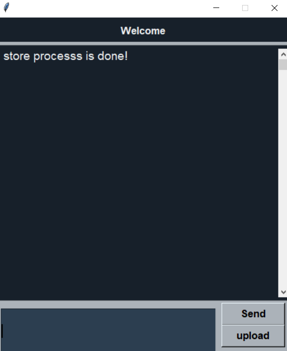
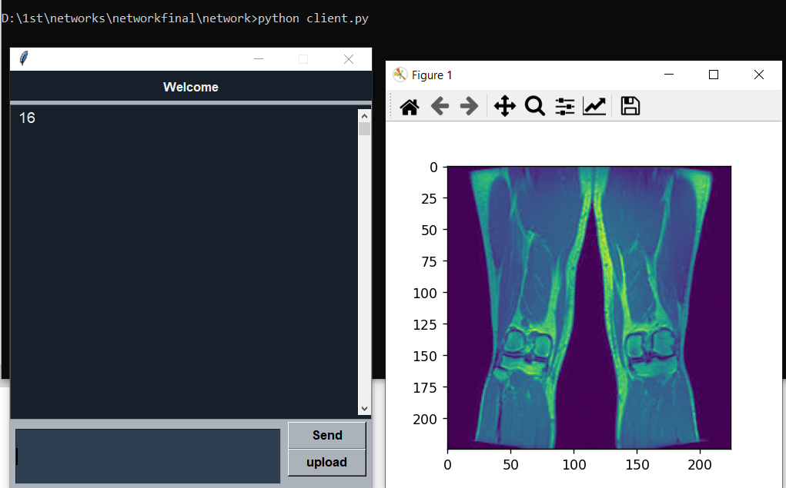
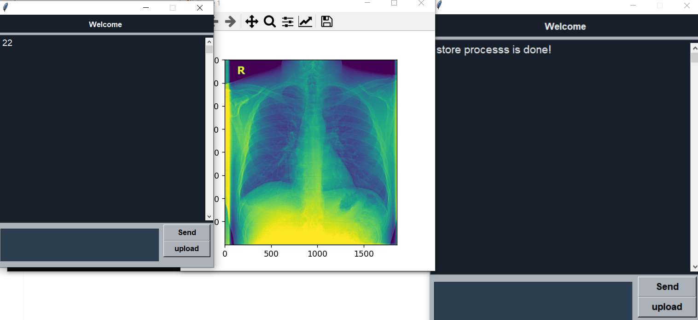

# Simulating PACS

A Simple system contains client(workstation) and server(PACS) exchange data(images) between each other. [[Video](https://drive.google.com/file/d/1XvDwINwQSz1X15lAZKjWsa8uC95qYjbT/view?usp=sharing)]

we tried to make a PACS service that enables the doctor to store an image in the database or retrieve image from the database with its ID which is in our database folder is from 1 to 41  


We built a server using socket library in Python that allowed us to generate communication with the clients using TCP/IP connection.


after uploading an image (by clicking on upload button and browse the image) from client to server(database) an message is inserted to user to tell him that the process is done.



retrieve image by its id by typing its id in text box then clicking on send button.



Multiple conncetions can be opend at the same time for multiple clients.




#### Note: We can't upload all database so [here is the link to it](https://drive.google.com/drive/folders/1sJD6bDQDrTq3BC2Ft4WG_Ys9Pl-VuSqL?usp=sharing). Each ID binds to an image so make sure the corresponding image exist while using its ID.

#### Images must be added in `images folder`.


#### problems:
we had a problem that every client can make a single storing or retrieving because after the single task is done the conncetion between this client and the server is closed immediately but on the other hand multiple users can connect in the same time.


# Setup

1. From the command line create a virtual environment and activate.
```sh
# Windows (CMD)
> python -m venv .venv
> .venv\Scripts\activate

# Linux
> python3 -m venv .venv
> source .venv/bin/activate
```

2. Install dependencies.
```sh
> pip install -r requirements.txt
```


3. Run the server.
```sh
> python server.py 
```

4. Run the client.
```sh
> python client.py
```
